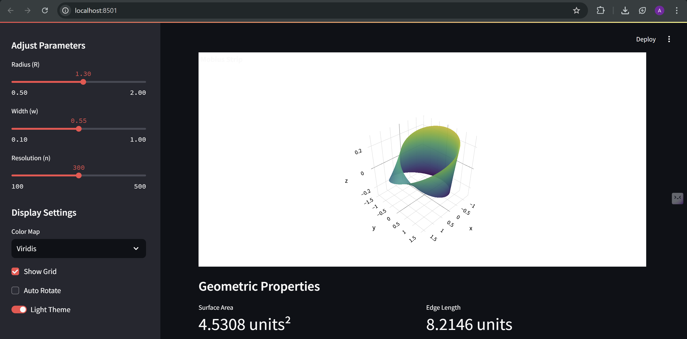

# Mobius Strip Visualizer (https://abhishek-b-shetty-karkhana-io.streamlit.app/)
## screen recording drive link
https://drive.google.com/file/d/1FqXu5aBemWNB93RAuQU2-HyOpt3KErP_/view?usp=sharing
An interactive 3D visualization and analysis tool for the Möbius strip, implemented in Python using Streamlit and Plotly.

Below is a screenshot of the interactive Möbius strip visualizer in action:



## Overview

This project provides a mathematical model and interactive visualization of a Möbius strip, a non-orientable surface with only one side and one boundary. The implementation includes:

- Parametric modeling of the Möbius strip
- Interactive 3D visualization
- Surface area and edge length calculations
- Export functionality to .obj format


## Features

- **Interactive Controls**:
  - Adjust radius, width, and resolution
  - Choose from multiple color maps
  - Toggle grid visibility
  - Enable/disable auto-rotation
  - Switch between light and dark themes

- **Geometric Properties**:
  - Real-time surface area calculation
  - Edge length computation
  - High-resolution mesh generation

- **Export Options**:
  - Download the model as a .obj file for use in 3D modeling software

## Installation

1. Clone this repository
2. Install the required dependencies:
```bash
pip install -r requirements.txt
```

## Usage

Run the Streamlit app:
```bash
streamlit run app.py
```

## Technical Details

### Parametric Equations

The Möbius strip is defined using the following parametric equations:

- x(u,v) = (R + v·cos(u/2))·cos(u)
- y(u,v) = (R + v·cos(u/2))·sin(u)
- z(u,v) = v·sin(u/2)

Where:
- R: Radius of the central circle
- w: Width of the strip
- u ∈ [0, 2π]
- v ∈ [-w/2, w/2]

### Implementation Structure

- `mobius.py`: Contains the `MobiusStrip` class that handles:
  - Parametric surface generation
  - Surface area calculation using numerical integration
  - Edge length computation
  - Mesh generation

- `app.py`: Streamlit web application that provides:
  - Interactive parameter controls
  - 3D visualization using Plotly
  - Real-time property calculations
  - Export functionality

## Dependencies

- Python 3.x
- NumPy
- Streamlit
- Plotly

## License

This project is open source and available under the MIT License.

## Author

ABHISHEK B SHETTY

## Acknowledgments

- The mathematical model is based on standard parametric equations for the Mobius strip
- Visualization powered by Plotly and Streamlit 
